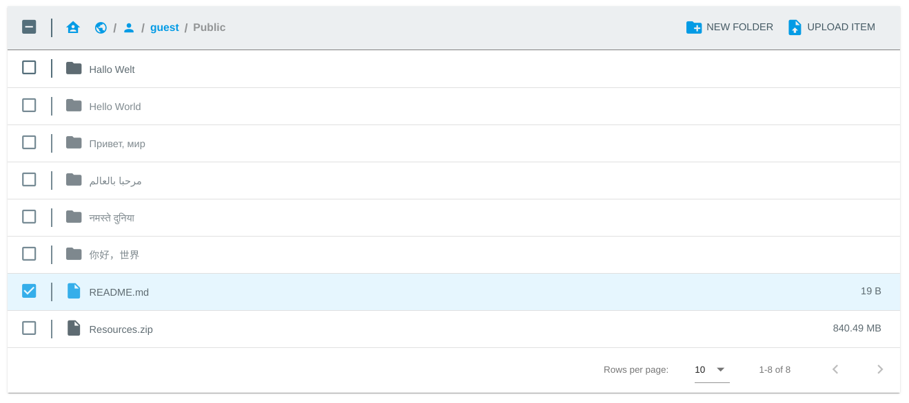

# Girder web component library

Try the [demo app](https://girder.github.io/girder_web_components/).
It works with [data.kitware.com](https://data.kitware.com/).

## Usage Quckstart

### Installation

```bash
npm install @girder/components
# or
yarn add @girder/components
```

[VueCLI](https://cli.vuejs.org/) is required for building applications with Girder web components.
However, a few additional packages must still be manually installed:
```bash
npm install -D sass-loader node-sass pug-plain-loader pug stylus-loader stylus vue-cli-plugin-vuetify vuetify-loader
# or
yarn add -D sass-loader node-sass pug-plain-loader pug stylus-loader stylus vue-cli-plugin-vuetify vuetify-loader
```

### Initialization

Encapsulating the configuration in another file (typically `src/plugins/girder.js`) is a good practice:

```javascript
/* src/plugins/girder.js */
import Vue from 'vue';
import Girder, { RestClient } from '@girder/components/src';

// Install the Vue plugin that lets us use the components
Vue.use(Girder);

// This connects to another server if the VUE_APP_API_ROOT
// environment variable is set at build-time
const apiRoot = process.env.VUE_APP_API_ROOT || 'http://localhost:8080/api/v1';

// Create the axios-based client to be used for all API requests
const girderRest = new RestClient({
  apiRoot,
});

// This is passed to our Vue instance; it will be available in all components
const GirderProvider = {
  girderRest,
};
export default GirderProvider;
```

Reference the configuration from your application initialization (typically `src/main.js`):

```javascript
/* src/main.js */
import GirderProvider from '@/plugins/girder';

// ...

new Vue({
  provide: GirderProvider,
  // ...
}).$mount('#app');
```

### Using Components

Components should be imported by name from `@girder/components/src/components`, as this location will be stable across releases.
For instance:
```javascript
import { Upload as GirderUpload } from '@girder/components/src/components';  // Good
import GirderUpload from '@girder/components/src/components/Upload.vue'; // Unsafe -- may move in future
```

Since Girder web components uses Vuetify, your application must provide
[`v-app` and `v-content` containers](https://vuetifyjs.com/en/framework/default-markup#all-about-app)
at some ancestor level.

For example, to create a login / registration widget in `src/App.vue`:

```html
<!-- src/App.vue -->
<template>
  <v-app>
    <v-content>
      <h1>Welcome {{ currentUserLogin }}</h1>
      <GirderAuthentication register />
    </v-content>
  </v-app>
</template>

<script>
import { Authentication as GirderAuthentication } from '@girder/components/src/components';

export default {
  components: {
    GirderAuthentication,
  },

  // Injecting is not necessary to use the component,
  // but is required to access the results of API calls
  inject: ['girderRest'],
  computed: {
    currentUserLogin() {
      return this.girderRest.user ? this.girderRest.user.login : 'anonymous';
    },
  },
};
</script>
```

See [the demo app](demo/App.vue) for a more comprehensive example.

## Advanced Usage

### Customizing Styling

If your downstream application is also using Vuetify, and needs to pass additional configuration
options to Vuetify, it must be careful to coordinate with Girder web components.

Additional Vuetify configuration should inherit from Girder web components own configuration:
```javascript
import { merge } from 'lodash';
import { vuetifyConfig as girderVuetifyConfig } from '@girder/components/src/utils';

// More complicated merging could use Lodash's _.merge
const appVuetifyConfig = merge(girderVuetifyConfig, {
  icons: {
    'myCustomIcon': 'mdi-custom-icon'
  }
});
```

Any custom configuration must be passed to Vuetify before Girder web components is
installed to Vue:
```javascript
// This order is important
Vue.use(Vuetify, appVuetifyConfig);
Vue.use(Girder);
```

### Other installation methods
It's not necessary to install Girder web components yourself, you can import the prebuilt bundle
into your page by including the following tags:

```html
<script src="https://unpkg.com/vue/dist/vue.min.js"></script>
<script src="https://unpkg.com/@girder/components"></script>
<link rel="stylesheet" href="https://unpkg.com/@girder/components/dist/girder.css">
```

This will expose all the library's components under the global variable `girder`, e.g.
`girder.components.Upload`.

> **Note:** If importing this library's UMD bundle via a ``<script>`` tag, the incantation for
> installing the Vue plugin is slightly different:
> ```javascript
> Vue.use(girder.default);
> ```

## For developers

```bash
# Project Setup
yarn

# Compile and hot-reload for development
yarn serve

# Build the library for production
yarn build

# Lint and fix source code
yarn lint

# Run unit tests
yarn test:unit
```

### Use an external Girder API

To build the demo app against an external Girder API, set the
`VUE_APP_API_ROOT` environment variable. For example:

```bash
export VUE_APP_API_ROOT=https://data.kitware.com/api/v1
yarn serve
```

This variable value defaults to `http://localhost:8080/api/v1` for
normal development (which assumes the developer has a local instance of
the Girder API server running).
